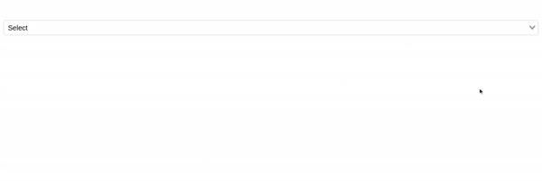

# VueJS Multiselect Dropdown Component

vue-weblineindia-multiselect is a feature rich select / dropdown / typeahead component. It provides a default template that fits most use cases for a filterable multi-select dropdown. A lightweight component with easy accessibility and customization.

- Tagging
- Filtering / Searching
- Accessible
- Vuex Support
- AJAX Support
- SSR Support
- Zero dependencies
- Select Single/Multiple Options
- Customizable with slots and SCSS variables


## Table of contents

- [Browser Support](#browser-support)
- [Demo](#demo)
- [Getting started](#getting-started)
- [Import styles](#import-styles)
- [Usage](#usage)
- [Available Props](#available-props)
- [Events](#events)
- [Slots](#slots)
- [Sass](#sass)
- [Want to Contribute?](#want-to-contribute)
- [Need Help / Support?](#need-help)
- [Collection of Other Components](#collection-of-components)
- [Changelog](#changelog)
- [Credits](#credits)
- [License](#license)
- [Keywords](#Keywords)

## Browser Support

 |  |  |  |  |
--- | --- | --- | --- | --- |
83.0 ✔ | 77.0  ✔ | 13.1.1 ✔ | 83.0 ✔ | 11.9 ✔ |

## Demo

[](https://github.com/weblineindia/Vue-Multiselect-Dropdown/multiselect.gif)

## Getting started

```bash
yarn add vue-weblineindia-multiselect

# or use npm

npm install vue-weblineindia-multiselect
```

Then, import and register the component:

```js
import Vue from "vue";
import multiSelect from "vue-weblineindia-multiselect";

Vue.component("v-multiselect", multiSelect);
```

The component itself does not include any CSS. You'll need to include it separately:

```js
import "vue-weblineindia-multiselect/lib/vue-select.css";
```

Alternatively, you can import the scss for complete control of the component styles:

```scss
@import "vue-weblineindia-multiselect/src/scss/vue-select.scss";
```

## Usage

```html
<template>
  <div id="app">
    <v-multiselect v-model="value" :options="optionArray" multiple :placeholder="'Select'"/>
  </div>
</template>
```

```js
export default {
  data() {
    return {
      value: [],
      optionArray: ["option 1", "option 2", "option 3", "option 4"]
    };
  },
}
```
#### Available Props

| Prop             | Data Type |Default| Description        |
| ---------------- | ---------|-------|------------------ |
| `append-icon` | string | '$dropdown' | Appends an icon to the component, uses the same syntax as v-icon |
| `append-outer-icon` | string | undefined | Appends an icon to the outside the component's input, uses same syntax as v-icon |
| `attach` | any | false | Specifies which DOM element that this component should detach to.String can be any valid querySelector and Object can be any valid Node. This will attach to the root v-app component by default. |
| `autofocus` | boolean | false | Enables autofocus |
| `background-color` | string | undefined | Changes the background-color of the input |
| `cache-items` | boolean | false | Keeps a local unique copy of all items that have been passed through the items prop. |
| `chips` | boolean | false | Changes display of selections to chips. |
| `clear-icon` | string | '$clear' | Applied when using clearable and the input is dirty. |
| `clearable` | boolean | false | Add input clear functionality, default icon is Material Icons clear. |
| `color` | string | undefined | Applies specified color to the control - it can be the name of material color (for example success or purple) or css color (#033 or rgba(255, 0, 0, 0.5)). |
| `counter` | boolean/number/string | undefined | Creates counter for input length; if no number is specified, it defaults to 25. Does not apply any validation. |
| `counter-value` | function | null |  |
| `dark` | boolean | false | Applies the dark theme variant to the component |
| `deletable-chips` | boolean | false | Adds a remove icon to selected chips |
| `dense` | boolean | false | Reduces the input height |
| `disable-lookup` | boolean | false | Disables keyboard lookup |
| `disabled` | boolean | false | Disables the input |
| `eager` | boolean | false | Will force the components content to render on mounted. This is useful if you have content that will not be rendered in the DOM that you want crawled for SEO. |
| `error` | boolean | false | Puts the input in a manual error state |
| `error-count` | number/string | 1 | The total number of errors that should display at once |
| `error-messages` | string/array | [] | Puts the input in an error state and passes through custom error messages. Will be combined with any validations that occur from the rules prop. This field will not trigger validation |
| `filled` | boolean | false | Applies the alternate filled input style |
| `filter` |  | (item: object, queryText: string, itemText: string): boolean | The function used for filtering items |
| `flat` | boolean | false | Removes elevation (shadow) added to element when using the solo or solo-inverted props |
| `full-width` | boolean | false | Designates input type as full-width |
| `height` | number/string | undefined | Sets the height of the input |
| `hide-details` | boolean/string | undefined | Hides hint and validation errors. When set to auto messages will be rendered only if there's a message (hint, error message, counter value etc) to display |
| `hide-selected` | boolean | false | Do not display in the select menu items that are already selected |
| `hint` | string | undefined | Hint text |
| `id` | string | undefined | Sets the DOM id on the component |
| `item-color` | string | 'primary' | Sets color of selected items |
| `item-disabled` | array/string/function | disabled | Set property of items's disabled value |
| `item-text` | array/string/function | text | Set property of items's text value |
| `item-value` | array/string/function | value | Set property of items's  value |
| `items` | array | [] | Can be an array of objects or array of strings. When using objects, will look for a text and value field. This can be changed using the item-text and item-value props. Objects that have a header or divider property are considered special cases and generate a list header or divider; these items are not selectable. |
| `label` | string |  | Sets input label |
| `light` | boolean | false | Applies the light theme variant to the component. |
| `loader-height` | number/string | 2 | Specifies the height of the loader |
| `loading` | boolean/string | false | Displays linear progress bar. Can either be a String which specifies which color is applied to the progress bar (any material color or theme color - primary, secondary, success, info, warning, error) or a Boolean which uses the component color (set by color prop - if it's supported by the component) or the primary color     |
| `menu-props` | array/string/object | { "closeOnClick": false, "closeOnContentClick": false, "disableKeys": true, "openOnClick": false, "maxHeight": 304 } | Pass props through to the v-menu component. Accepts either a string for boolean props menu-props="auto, overflowY", or an object :menu-props="{ auto: true, overflowY: true }". |
| `messages` | string/array | [] | Displays a list of messages or message if using a string. |
| `multiple` | boolean | true | Changes select to multiple. Accepts array for value. |
| `no-data-text` | string | '$vuetify.noDataText' | Display text when there is no data. |
| `open-on-clear` | boolean | false |When using the clearable prop, once cleared, the select menu will either open or stay open, depending on the current state. |
| `outlined` | boolean | false | Applies the outlined style to the input. |
| `persistent-hint` | boolean | false | Forces hint to always be visible. |
| `placeholder` | string | Select | Sets the input’s placeholder text. |
| `prefix` | string | undefined | Displays prefix text. |
| `prepend-icon` | string | undefined | Prepends an icon to the component, uses the same syntax as v-icon. |
| `prepend-inner-icon` | string | undefined | Prepends an icon inside the component's input, uses the same syntax as v-icon. |
| `readonly` | boolean | false | Puts input in readonly state. |
| `return-object` | boolean | false |Changes the selection behavior to return the object directly rather than the value specified with item-value. |
| `reverse` | boolean | false | Reverses the input orientation. |
| `rounded` | boolean | false | Adds a border radius to the input. |
| `rules` | array | [] | Accepts an array of functions that take an input value as an argument and return either true / false or a string with an error message. |
| `shaped` | boolean | false | Round if outlined and increase border-radius if filled. Must be used with either outlined or filled.|
| `single-line` | boolean | false |Label does not move on focus/dirty. |
| `small-chips` | boolean | false | Changes display of selections to chips with the small property. |
| `solo` | boolean | false | Changes the style of the input. |
| `solo-inverted` | boolean | false |Reduces element opacity until focused. |
| `success` | boolean | false | Puts the input in a manual success state. |
| `success-messages` | string/array | [] | Puts the input in a success state and passes through custom success messages.. |
| `suffix` | string | undefined | Displays suffix text. |
| `type` | string | text | Sets input type. |
| `validate-on-blur` | boolean | false | Delays validation until blur event. |
| `value` | any | default | The input's value. |
| `value-comparator` | function | (a: any, b: any): boolean | The comparison algorithm used for values. |

#### Events

| Name                    | Description        | Value        |
| ----------------------- | --------------- | -|
| `blur`        | Emitted when the input is blurred 			| Event |
| `change`        | Emitted when the input is changed by user interaction 			| any |
| `click`        | Emitted when input is clicked 			| MouseEvent |
| `click:append`        | Emitted when appended icon is clicked 			| Event |
| `click:append-outer`        | Emitted when appended outer icon is clicked 			| Event |
| `click:clear`        | Emitted when clearable icon clicked 			| Event |
| `click:prepend`        | Emitted when prepended icon is clicked			| Event |
| `click:prepend-inner`        | Emitted when prepended inner icon is clicked			| Event |
| `focus`        | Emitted when component is focused			| Event |
| `input`        | The updated bound model			| any |
| `keydown`        | Emitted when any key is pressed 			| KeyboardEvent |
| `mousedown`        | Emitted when click is pressed 			| MouseEvent |
| `mouseup`        | Emitted when click is released 			| MouseEvent |
| `update:error`        | The error.sync event			| boolean |
| `update:list-index`        | Emitted when menu item is selected using keyboard arrows 			| number |
| `update:search-input`        | The search-input.sync event			| string |

#### Slots

| Name                    | Description        |
| ----------------------- | -|
| `append`         | Adds an item inside the input and after input content |
| `append-item`    | Adds an item after menu content |
| `append-outer`   | Adds an item outside the input and after input content |
| `default`        | The default Vue slot. |
| `item`           | Define a custom item appearance |
| `label`          | Replaces the default label |
| `message`        |Customize the messages slot. |
| `no-data`        |Displayed when there are no filtered items. |
| `prepend`        |Adds an item outside the input and before input content. |
| `prepend-inner`  |Adds an item inside the input and before input content. |
| `prepend-item`   |Adds an item before menu content. |
| `progress`       |Slot for custom progress linear (displayed when loading prop is not equal to Boolean False). |
| `selection`      |Define a custom selection appearance. |

#### Sass

| Name                    | Default        | 
| ----------------------- | -|
| `$select-active-chip-opacity`        | 0.2 !default; 			| 
| `$select-active-icon-flip`                | true !default;         | 
| `$select-chip-margin`                | 4px !default;         | 
| `$select-chips-box-enclosed-selections-min-height`                | 68px !default;         | 
| `$select-chips-dense-selections-min-height`                | 40px !default;         | 
| `$select-chips-dense-selections-padding-top`                | 40px !default;         | 
| `$select-chips-selections-padding-top`                | 42px !default;         | 
| `$select-dense-chip-margin`                | 0 4px 0 4px !default;         | 
| `$select-dense-selections-margin`                | 5px 4px 3px 0 !default;        | 
| `$select-outlined-dense-selections-padding-top`                | 4px 0 !default;        | 
| `$select-outlined-selections-padding-top`                | 8px 0 !default;         | 
| `$select-prefix-line-height`                |20px !default;        | 
| `$select-selected-chip-opacity`                | .22 !default;        | 
| `$select-selections-line-height`                | 18px !default;        | 
| `$select-selections-margin`                |7px 4px 7px 0 !default;        | 
| `$select-selections-padding-top`                | 20px !default;       | 
| `$select-small-chips-dense-selections-min-height`                | 38px !default;       | 
| `$select-small-chips-selections-min-height`                | 26px !default;        | 

## Want to Contribute?

- Created something awesome, made this code better, added some functionality, or whatever (this is the hardest part).
- [Fork it](http://help.github.com/forking/).
- Create new branch to contribute your changes.
- Commit all your changes to your branch.
- Submit a [pull request](http://help.github.com/pull-requests/).

-----

## Need Help? 

We also provide a free, basic support for all users who want to use this VueJS based Multiselect Dropdown component in their software project. In case you want to customize this Multiselect dropdown component to suit your development needs, then feel free to contact our [VueJS developers](https://www.weblineindia.com/hire-vuejs-developer.html).

-----

## Collection of Components

We have built many other components and free resources for software development in various programming languages. Kindly click here to view our [Free Resources for Software Development](https://www.weblineindia.com/communities.html).

------

## Changelog

Detailed changes for each release are documented in [CHANGELOG.md](./CHANGELOG.md).

## Credits

vue-weblineindia-multiselect is inspired by [vue-select](https://vuetifyjs.com/en/components/selects/#examples).

## License

[MIT](LICENSE)

[mit]: https://github.com/weblineindia/Vue-Multiselect-Dropdown/blob/master/LICENSE

## Keywords

vue-weblineindia-multiselect,multiselect,select,vue components,vuejs,vuejs component
